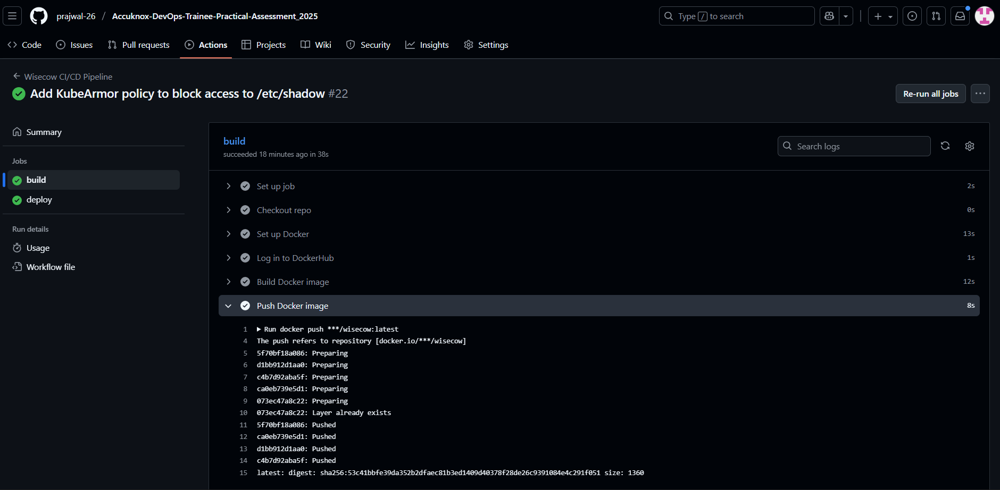
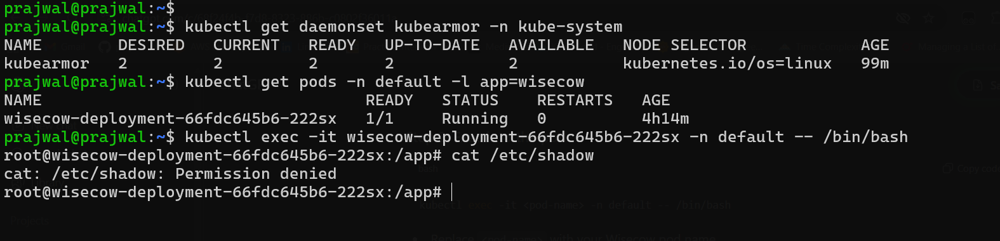

# Accuknox-DevOps-Trainee-Practical-Assessment_2025
Problem Statement 2: Automated Backup Solution

This task demonstrates the automated backup of a specified directory to an S3 bucket.

### Screenshots
 
1. Backup script added:  

3. Backup log report:  

4. Final verification:  

 System Health Monitoring Script

********************************************************************************************************************************************

 - Containerisation and Deployment of Wisecow Application on Kubernetes

I containerized the application using Docker and deployed it on Amazon EKS with Kubernetes manifests for deployment, service, ingress, and a self-signed TLS certificate. The application is exposed via a Classic Load Balancer (CLB) with HTTPS enabled. I set up a CI/CD pipeline to automate build and deployment, with screenshots showing successful execution.

- KubeArmor policy for the Kubernetes workload
- 
Additionally, I applied KubeArmor policies to enforce access restrictions on sensitive paths, ensuring pod-level security. All manifests, policies, and scripts are included in the repo for review.

